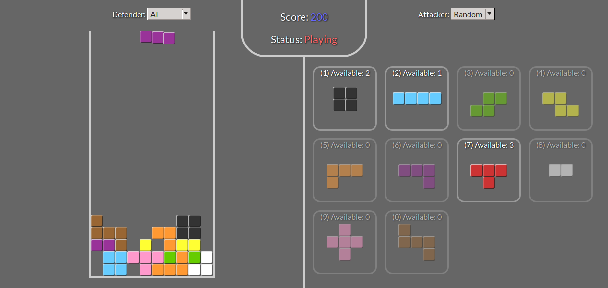

# Custom Tetris

Play the classic Tetris game **the way you like it!** Adjust the rules, *change* the sides! 
Playable version at http://ondras.github.io/custom-tetris/.

## Instructions

Configure the game by choosing an attacker (the one who picks pieces) and a defender (the one who positions pieces). 
The attacker is given a stash of pieces to pick from; once they are depleted, the stash completely refreshes.

When playing human attacker, either click the pieces or hit number keys to pick them.

When playing human defender, use four arrow keys to position, rotate and drop the current piece.

## Technologies

* Written in vanilla JS, no libraries used
* Polyfill for `classList`
* Uses CSS transforms and transitions
* Uses [Firebase](https://www.firebase.com/) as a networking backend
* Works in FF, Chrome, Opera, Safari, IE10

## DevLog

* Day 1: forked
* Days 2 to 3: looking for ideas
* Day 4: got an idea, started first API draft
* Day 5: experiments with the main Engine object, still no visuals
* Day 6: working engine, visuals, human defender, ai defender
* Day 7: bugfixing async issues, basic set of pieces, readonly gallery
* Day 8: human (working) and ai (unusable) attackers, bonus pieces
* Day 9: refactored attacker rules, UI tuning, Game.App draft
* Day 10: setup texts and UI
* Day 11: finalizing setup UI, basic network experiments
* Days 12 to 13: tuning network synchronization
* Days 14 to 17: idle, frustrated by poor networking experience
* Day 18: refactoring networking code
* Day 19: rejoicing at the fixed networking experience, tuning, testing
* Day 20: release
* Day 28: final fixes and testing

## License

This game is distributed under the terms of the New BSD license.
